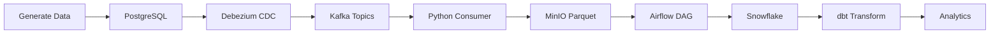

# 🏦 Banking Modern Data Stack

<div align="center">


**A complete end-to-end real-time banking data pipeline built with modern data engineering tools**

[Features](#-features) • [Architecture](#-architecture) • [Quick Start](#-quick-start) • [Components](#-tech-stack) • [Troubleshooting](#-troubleshooting)

</div>

---

## 📋 Table of Contents

- [Overview](#-overview)
- [Features](#-features)
- [Architecture](#-architecture)
- [Tech Stack](#-tech-stack)
- [Prerequisites](#-prerequisites)
- [Quick Start](#-quick-start)
- [Project Structure](#-project-structure)
- [Configuration](#-configuration)
- [Usage Guide](#-usage-guide)
- [Troubleshooting](#-troubleshooting)
- [Contributing](#-contributing)

---

## 🎯 Overview

This project implements a **production-grade data pipeline** for a banking system, demonstrating modern data engineering best practices. It captures real-time database changes, streams them through Kafka, stores them in object storage, and loads them into a data warehouse for analytics.

### 🎪 What This Pipeline Does

```
📊 Generate Fake Banking Data → 🗄️ PostgreSQL → 🔄 CDC (Debezium) →
📨 Apache Kafka → 🐍 Python Consumer → 💾 MinIO (S3) →
✈️ Apache Airflow → ❄️ Snowflake → 📈 dbt Transformations
```

---

## ✨ Features

- 🔄 **Real-time CDC** - Capture database changes as they happen using Debezium
- 📊 **Streaming Data** - Process banking transactions through Apache Kafka
- 🎭 **Realistic Data** - Generate fake banking data with Faker library
- 💾 **Data Lake Storage** - Store raw data in MinIO (S3-compatible object storage)
- 🔀 **Batch Processing** - Orchestrate data loads with Apache Airflow
- 🏗️ **Data Modeling** - Transform data with dbt (Data Build Tool)
- 🐳 **Fully Containerized** - Everything runs in Docker containers
- 📈 **Scalable Architecture** - Built for production workloads

---

## 🏗️ Architecture

```
┌─────────────────────────────────────────────────────────────────────┐
│                        DATA GENERATION LAYER                         │
├─────────────────────────────────────────────────────────────────────┤
│                                                                      │
│  ┌──────────────────┐         ┌─────────────────────────────┐      │
│  │  Fake Generator  │────────>│  PostgreSQL (CDC Enabled)   │      │
│  │  (Python/Faker)  │         │  • Customers                │      │
│  └──────────────────┘         │  • Accounts                 │      │
│                                │  • Transactions             │      │
│                                └─────────────────────────────┘      │
│                                           │                          │
└───────────────────────────────────────────┼──────────────────────────┘
                                            │
                                            ▼
┌─────────────────────────────────────────────────────────────────────┐
│                      STREAMING LAYER (CDC)                           │
├─────────────────────────────────────────────────────────────────────┤
│                                                                      │
│  ┌──────────────────┐         ┌─────────────────────────────┐      │
│  │  Debezium        │────────>│    Apache Kafka             │      │
│  │  (PostgreSQL)    │         │    • Zookeeper              │      │
│  │  Connector       │         │    • 3 Topics (CDC events)  │      │
│  └──────────────────┘         └─────────────────────────────┘      │
│                                           │                          │
└───────────────────────────────────────────┼──────────────────────────┘
                                            │
                                            ▼
┌─────────────────────────────────────────────────────────────────────┐
│                         STORAGE LAYER                                │
├─────────────────────────────────────────────────────────────────────┤
│                                                                      │
│  ┌──────────────────┐         ┌─────────────────────────────┐      │
│  │  Kafka Consumer  │────────>│         MinIO               │      │
│  │  (Python)        │         │  (S3-compatible storage)    │      │
│  │  • Batch writes  │         │  • Parquet files            │      │
│  │  • Parquet format│         │  • Date partitioned         │      │
│  └──────────────────┘         └─────────────────────────────┘      │
│                                           │                          │
└───────────────────────────────────────────┼──────────────────────────┘
                                            │
                                            ▼
┌─────────────────────────────────────────────────────────────────────┐
│                   ORCHESTRATION & WAREHOUSE LAYER                    │
├─────────────────────────────────────────────────────────────────────┤
│                                                                      │
│  ┌──────────────────┐         ┌─────────────────────────────┐      │
│  │ Apache Airflow   │────────>│       Snowflake             │      │
│  │  • Scheduler     │         │  • Raw tables               │      │
│  │  • DAG: MinIO    │         │  • Staging                  │      │
│  │    to Snowflake  │         │  • Production               │      │
│  └──────────────────┘         └─────────────────────────────┘      │
│           │                               │                          │
│           │                               │                          │
│           │                   ┌───────────▼───────────┐             │
│           │                   │      dbt Core         │             │
│           └──────────────────>│  • Transformations    │             │
│                               │  • Data modeling      │             │
│                               │  • Tests & docs       │             │
│                               └───────────────────────┘             │
│                                                                      │
└─────────────────────────────────────────────────────────────────────┘
```

---

## 🛠️ Tech Stack

### Core Technologies

| Component                  | Technology               | Purpose                                       |
| -------------------------- | ------------------------ | --------------------------------------------- |
| 🐘 **Source Database**     | PostgreSQL 15 (Debezium) | Operational banking database with CDC enabled |
| 🔄 **Change Data Capture** | Debezium 2.3             | Real-time database change streaming           |
| 📨 **Message Broker**      | Apache Kafka 7.6.1       | Event streaming platform                      |
| 🐍 **Stream Consumer**     | Python 3.13              | Consumes Kafka events and processes data      |
| 💾 **Object Storage**      | MinIO                    | S3-compatible data lake storage               |
| ✈️ **Orchestration**       | Apache Airflow 2.9.3     | Workflow management and scheduling            |
| ❄️ **Data Warehouse**      | Snowflake                | Cloud data warehouse                          |
| 🏗️ **Transformation**      | dbt Core                 | Data modeling and transformations             |
| 🐳 **Containerization**    | Docker Compose           | Container orchestration                       |

### Python Libraries

```python
# Data Generation
faker              # Generate realistic fake data
psycopg2-binary    # PostgreSQL adapter

# Streaming & CDC
kafka-python       # Kafka consumer/producer
requests           # HTTP library for Debezium API

# Data Processing
pandas             # Data manipulation
fastparquet        # Parquet file format support
boto3              # MinIO/S3 client

# Orchestration
dbt-core           # Data transformation framework
dbt-snowflake      # Snowflake adapter for dbt
```

---

## 📋 Prerequisites

Before you begin, ensure you have:

- ✅ **Docker Desktop** (v20.10+) with Docker Compose
- ✅ **Python 3.13** or higher
- ✅ **Snowflake Account** (for warehouse layer)
- ✅ **8GB+ RAM** (recommended)
- ✅ **20GB+ Disk Space**

### Port Requirements

Make sure these ports are available:

| Port    | Service                       |
| ------- | ----------------------------- |
| `5432`  | PostgreSQL (Banking DB)       |
| `5433`  | PostgreSQL (Airflow Metadata) |
| `2181`  | Zookeeper                     |
| `19092` | Kafka (Host Access)           |
| `8083`  | Debezium Connect              |
| `9000`  | MinIO API                     |
| `9001`  | MinIO Console                 |
| `8080`  | Airflow Webserver             |

---

## 🚀 Quick Start

### 1️⃣ Clone the Repository

```bash
git clone https://github.com/DKLOCHANA/Banking-Data-Pipeline.git
cd banking-modern-datastack
```

### 2️⃣ Set Up Environment Variables

Create the required `.env` files:

**Root `.env`:**

```bash
# Postgres (Banking DB)
POSTGRES_USER=postgres
POSTGRES_PASSWORD=postgres
POSTGRES_DB=banking

# MinIO
MINIO_ROOT_USER=minioadmin
MINIO_ROOT_PASSWORD=minioadmin

# Airflow DB
AIRFLOW_DB_USER=airflow
AIRFLOW_DB_PASSWORD=airflow
AIRFLOW_DB_NAME=airflow
```

**`consumer/.env`:**

```bash
# Kafka
KAFKA_BOOTSTRAP=localhost:19092
KAFKA_GROUP=minio-landing-group

# MinIO
MINIO_ENDPOINT=http://localhost:9000
MINIO_ACCESS_KEY=minioadmin
MINIO_SECRET_KEY=minioadmin
MINIO_BUCKET=raw
```

**`data-generator/.env`:**

```bash
POSTGRES_HOST=localhost
POSTGRES_PORT=5432
POSTGRES_DB=banking
POSTGRES_USER=postgres
POSTGRES_PASSWORD=postgres
```

**`kafka-debezium/.env`:**

```bash
POSTGRES_HOST=postgres
POSTGRES_PORT=5432
POSTGRES_USER=postgres
POSTGRES_PASSWORD=postgres
POSTGRES_DB=banking
```

### 3️⃣ Start the Infrastructure

```bash
# Start all Docker containers
docker compose up -d

# Wait ~30 seconds for all services to initialize
```

### 4️⃣ Initialize the Database Schema

```bash
# Connect to PostgreSQL and create tables
docker exec -it banking-modern-datastack-postgres-1 psql -U postgres -d banking
```

Run this SQL:

```sql
CREATE TABLE customers (
    id SERIAL PRIMARY KEY,
    first_name VARCHAR(100),
    last_name VARCHAR(100),
    email VARCHAR(255) UNIQUE,
    created_at TIMESTAMP DEFAULT CURRENT_TIMESTAMP
);

CREATE TABLE accounts (
    id SERIAL PRIMARY KEY,
    customer_id INT REFERENCES customers(id),
    account_type VARCHAR(50),
    balance DECIMAL(15,2),
    currency VARCHAR(3),
    created_at TIMESTAMP DEFAULT CURRENT_TIMESTAMP
);

CREATE TABLE transactions (
    id SERIAL PRIMARY KEY,
    account_id INT REFERENCES accounts(id),
    txn_type VARCHAR(50),
    amount DECIMAL(15,2),
    related_account_id INT,
    status VARCHAR(50),
    created_at TIMESTAMP DEFAULT CURRENT_TIMESTAMP
);
```

Type `\q` to exit.

### 5️⃣ Install Python Dependencies

```bash
pip install -r requirements.txt
```

### 6️⃣ Configure Debezium CDC Connector

```bash
python kafka-debezium/connector.py
```

Expected output: `✅ Connector created successfully!`

### 7️⃣ Start Data Generation

```bash
# Generate continuous fake banking data
python data-generator/fake_generator.py

# Or run once for testing
python data-generator/fake_generator.py --once
```

### 8️⃣ Start the Kafka Consumer

```bash
# In a new terminal
python consumer/kafka_to_minio.py
```

You should see:

```
✅ Connected to Kafka. Listening for messages...
[banking_server.public.customers] -> {'id': 1, 'first_name': 'John', ...}
✅ Uploaded 50 records to s3://raw/customers/date=2025-11-23/...
```

### 9️⃣ Access the Services

| Service           | URL                   | Credentials                 |
| ----------------- | --------------------- | --------------------------- |
| **MinIO Console** | http://localhost:9001 | `minioadmin` / `minioadmin` |
| **Airflow UI**    | http://localhost:8080 | `admin` / `admin`           |
| **Kafka Topics**  | `localhost:19092`     | -                           |
| **PostgreSQL**    | `localhost:5432`      | `postgres` / `postgres`     |

---

## 📁 Project Structure

```
banking-modern-datastack/
├── 📂 consumer/                    # Kafka consumer service
│   ├── kafka_to_minio.py          # Consumes Kafka → writes to MinIO
│   └── .env                        # Consumer configuration
│
├── 📂 data-generator/              # Fake data generation
│   ├── fake_generator.py          # Generates banking data
│   └── .env                        # Generator configuration
│
├── 📂 kafka-debezium/              # CDC configuration
│   ├── connector.py               # Debezium connector setup
│   └── .env                        # Debezium configuration
│
├── 📂 banking_dbt/                 # dbt project
│   ├── models/                    # SQL transformations
│   ├── dbt_project.yml            # dbt configuration
│   └── README.md                  # dbt documentation
│
├── 📂 docker/                      # Airflow & persistent data
│   ├── dags/                      # Airflow DAGs
│   │   └── minio_to_snowflake_dag.py
│   ├── logs/                      # Airflow logs
│   ├── plugins/                   # Airflow plugins
│   ├── minio/data/                # MinIO storage
│   └── postgres/data/             # PostgreSQL data
│
├── 📂 postgres/                    # Database initialization scripts
│
├── 📄 docker-compose.yml           # Infrastructure as code
├── 📄 dockerfile-airflow.dockerfile # Custom Airflow image
├── 📄 requirements.txt             # Python dependencies
├── 📄 .env                         # Root environment variables
└── 📄 README.md                    # This file
```

---

## ⚙️ Configuration

### Kafka Consumer Batch Settings

Edit `consumer/kafka_to_minio.py`:

```python
batch_size = 50  # Number of records per Parquet file
```

### Data Generator Settings

Edit `data-generator/fake_generator.py`:

```python
NUM_CUSTOMERS = 10           # Customers per iteration
ACCOUNTS_PER_CUSTOMER = 2    # Accounts per customer
NUM_TRANSACTIONS = 50        # Transactions per iteration
SLEEP_SECONDS = 2            # Delay between iterations
```

### Airflow DAG Schedule

Edit `docker/dags/minio_to_snowflake_dag.py`:

```python
schedule_interval="*/1 * * * *"  # Run every minute
```

---

## 📖 Usage Guide

### Monitor Data Flow

#### 1. Check Kafka Topics

```bash
docker exec kafka-banking kafka-topics --bootstrap-server localhost:9092 --list
```

#### 2. Check Message Count

```bash
docker exec kafka-banking kafka-run-class kafka.tools.GetOffsetShell \
  --broker-list localhost:9092 \
  --topic banking_server.public.customers
```

#### 3. Consume Messages (Debug)

```bash
docker exec kafka-banking kafka-console-consumer \
  --bootstrap-server localhost:9092 \
  --topic banking_server.public.customers \
  --from-beginning --max-messages 5
```

#### 4. Check MinIO Files

- Open http://localhost:9001
- Login with `minioadmin` / `minioadmin`
- Navigate to `raw` bucket
- View Parquet files by date partition

#### 5. Monitor Airflow DAGs

- Open http://localhost:8080
- Login with `admin` / `admin`
- Check `minio_to_snowflake_banking` DAG status

### Stop the Pipeline

```bash
# Stop data generator (Ctrl+C)
# Stop consumer (Ctrl+C)

# Stop Docker services
docker compose down

# Stop and remove volumes (WARNING: deletes all data)
docker compose down -v
```

---

## 🔧 Troubleshooting

### 🚨 Kafka Connection Issues

**Problem:** `NoBrokersAvailable` error

**Solution:**

```bash
# 1. Check if Kafka is running
docker ps | grep kafka

# 2. Test port connectivity
Test-NetConnection -ComputerName localhost -Port 19092

# 3. Restart Kafka
docker compose restart kafka

# 4. Wait 10 seconds and try again
```

### 🚨 Debezium Connector Issues

**Problem:** No messages in Kafka topics

**Solution:**

```bash
# 1. Check connector status
curl http://localhost:8083/connectors/postgres-connector/status

# 2. Delete and recreate connector
curl -X DELETE http://localhost:8083/connectors/postgres-connector
python kafka-debezium/connector.py

# 3. Restart Debezium Connect
docker compose restart connect
```

### 🚨 Consumer Not Receiving Messages

**Problem:** Consumer stuck on "Listening for messages..."

**Solutions:**

1. **Check if messages exist in Kafka:**

```bash
docker exec kafka-banking kafka-run-class kafka.tools.GetOffsetShell \
  --broker-list localhost:9092 \
  --topic banking_server.public.customers
```

2. **Reset consumer group:**
   Edit `consumer/.env` and change:

```bash
KAFKA_GROUP=minio-landing-group-v2  # Change version number
```

3. **Verify environment variables are loaded:**

```bash
cd consumer
python -c "from dotenv import load_dotenv; import os; load_dotenv(); print(os.getenv('KAFKA_BOOTSTRAP'))"
```

### 🚨 MinIO Connection Issues

**Problem:** Consumer can't connect to MinIO

**Solution:**

```bash
# Check MinIO is running
docker ps | grep minio

# Test connection
curl http://localhost:9000/minio/health/live

# Restart MinIO
docker compose restart minio
```

### 🚨 Port Already in Use

**Problem:** Port conflicts during startup

**Solution:**

```bash
# Find process using port (PowerShell)
Get-NetTCPConnection -LocalPort 19092 | Select-Object State, OwningProcess

# Kill process
Stop-Process -Id <PID> -Force

# Or change port in docker-compose.yml
```

---

## 🎯 Performance Tuning

### Optimize Consumer Throughput

```python
# In consumer/kafka_to_minio.py
consumer = KafkaConsumer(
    ...,
    max_poll_records=500,        # Fetch more records per poll
    fetch_min_bytes=1024*1024,   # Wait for 1MB before returning
    consumer_timeout_ms=1000     # Poll timeout
)
```

### Kafka Configuration

```yaml
# In docker-compose.yml
environment:
  KAFKA_NUM_PARTITIONS: 3 # Increase partitions
  KAFKA_DEFAULT_REPLICATION_FACTOR: 1
  KAFKA_LOG_RETENTION_HOURS: 24 # Data retention
```

---

## 🤝 Contributing

Contributions are welcome! Please feel free to submit a Pull Request.

1. Fork the repository
2. Create your feature branch (`git checkout -b feature/AmazingFeature`)
3. Commit your changes (`git commit -m 'Add some AmazingFeature'`)
4. Push to the branch (`git push origin feature/AmazingFeature`)
5. Open a Pull Request

---

## 📝 License

This project is open source and available under the [MIT License](LICENSE).

---

## 👨‍💻 Author

**DKLOCHANA**

- GitHub: [@DKLOCHANA](https://github.com/DKLOCHANA)
- Repository: [Banking-Data-Pipeline](https://github.com/DKLOCHANA/Banking-Data-Pipeline)

---

## 🙏 Acknowledgments

- Apache Kafka community for the amazing streaming platform
- Debezium team for CDC capabilities
- Apache Airflow for workflow orchestration
- dbt Labs for the transformation framework
- Snowflake for the cloud data warehouse

---

## 📊 Data Flow Example



---

<div align="center">

### ⭐ Star this repository if you find it helpful!

Made with ❤️ by the data engineering community

</div>
